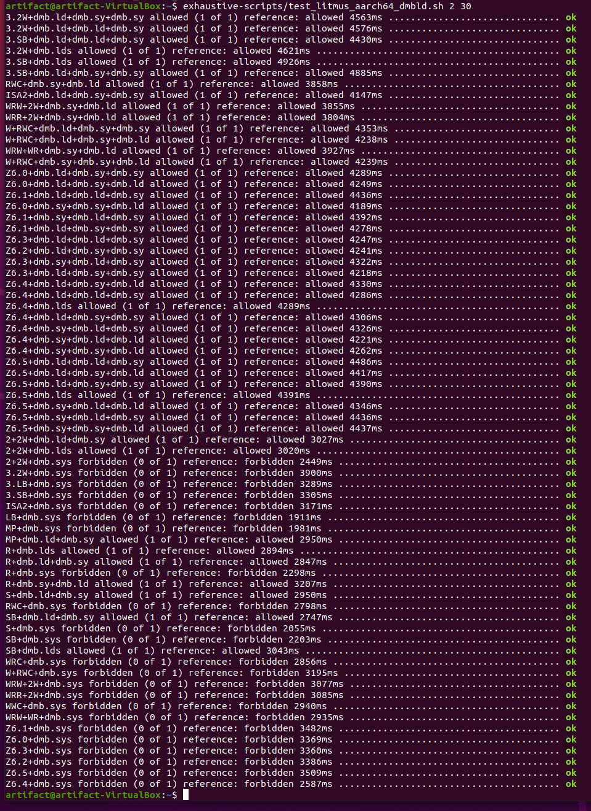
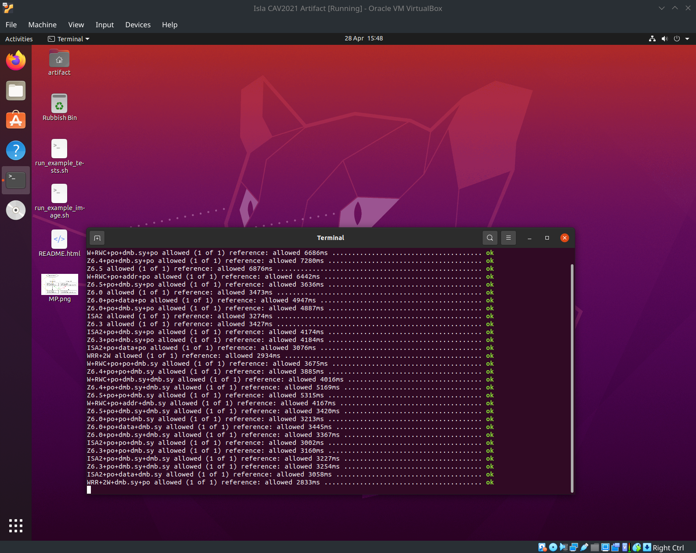
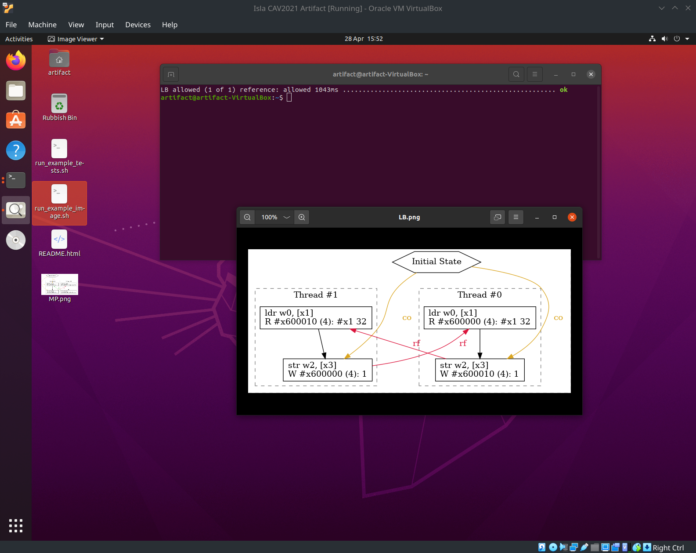
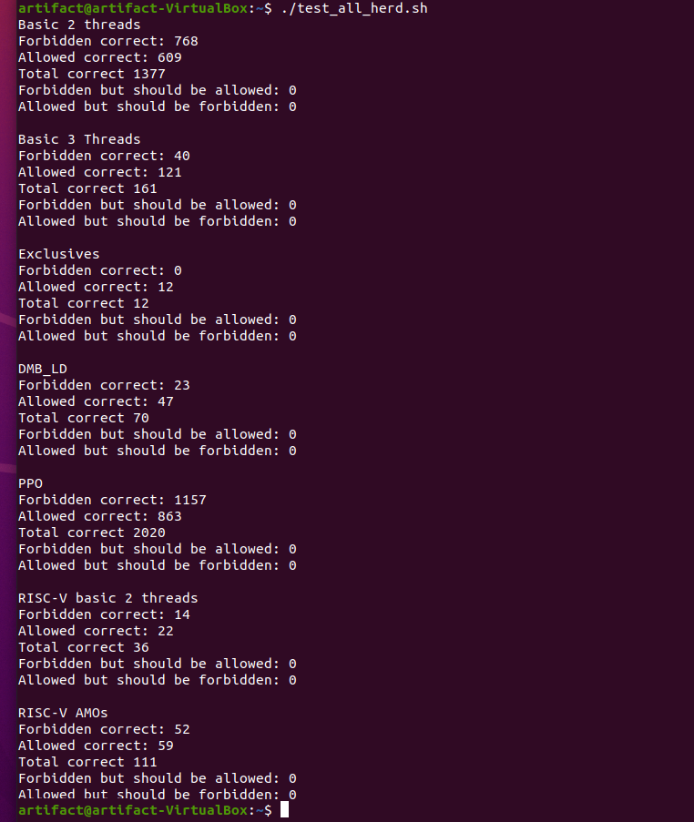
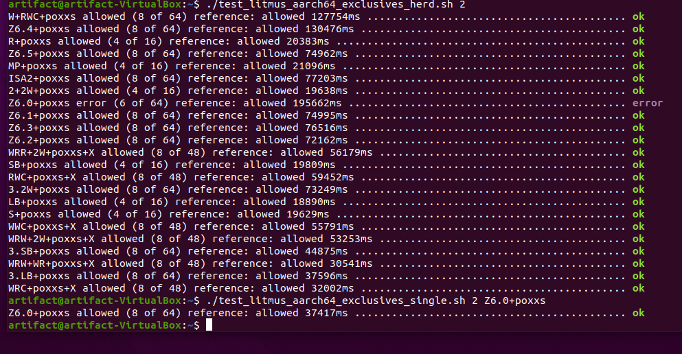

= Isla CAV 2021 Artifact
:toc:

Isla can be used either via a web interface, or it can also be
installed locally via crates.io or from the github sources.

The virtualbox image here is for the artifact review process, we do
not expect users of the tool to use the virtualbox image (and due to
performance costs associated with virtualbox, would actively
recommend against it).

== Virtualbox image

link:isla-cav-artifact-updated2.ova[Current virtualbox image]

md5sum: 2e471fd3f2501515cd19523caf2dfdd7

VM username: `artifact`

VM password: `cav2021`

=== Web interface

Isla can be used via an online web interface, available at:
https://isla-axiomatic.cl.cam.ac.uk. This website has some limitations
as compared with the tool being run locally, as it can only be used in
some pre-configured configurations, and has various resource
limits, but the web interface is easlier to use in some cases.

=== Basic instructions

The home directory of the virtual machine image contains various
scripts which can be used to run various sets of litmus tests. For
example, to run the AArch64 thread tests, the following command can be
used:

[source,bash]
----
artifact@artifact-VirtualBox:~$ ./test_litmus_aarch64_2_thread.sh 2 30
----

The first number after the script tells it how many tests to run in
parallel, and can be adjusted based on your hardware and how many
cores are available to the virtual machine.  The experimental results
from the paper used a machine with 36 physical cores.  Note that due
to how the script partitions work, this number must be at least 2. The
second number is the timeout parameter (in seconds).

On the virtual machine some tests can run _much slower_ than on actual
hardware, so some tests may timeout. We have observed that the tests
in the virtual machine often run about _one hundred_ times slower than
when run outside the VM image. The timeout option in the scripts can
be adjusted if necessary.

For each row in the table in Section 4 of the paper, there is a test
`test_litmus_` script in the home directory that runs those tests. For
example for the AArch64 basic 2 thread tests, there is the
`test_litmus_aarch64_2_thread.sh` script.

=== Experimental results

We consider the main result of the paper to be a tool that can run
system litmus tests (such as the ifetch example in Section 4) using
large scale ISA models written in Sail. We make this tool available as
a web interface to make it more broadly accessible without requiring
any complicated local installation.

Validating that the instruction fetch tests work can be done via the
`example_ifetch.sh` script in the home directory. The ifetch tests are
also available via the web interface. Using the *Litmus file* menu
option, followed by the *ESOP2020 ifetch* option, a selection of
ifetch examples can be used. Further examples from the ifetch-examples
directory in the virtual machine can be copied into the web interface
as desired.

The paper itself is not an experimental paper, although we validate
our tool with a selection of existing litmus tests, using reference
results obtained from RMEM and Herd. For completeness we include the
time taken to run these results, although in terms of performance we
only seek to claim that our tool is adequately performant for
regression testing a Sail model against a suite of tests. In practice
our tool can run on many more litmus test examples than are used in
the paper. The table in section 4 has seven lines, each corresponding
to a set of tests. These tests can be run with the following commands
(in the same order they appear in the Section 4 table), all of which
are scripts in the home directory of the virtual machine:

[source,bash]
----
./test_litmus_aarch64_2_thread.sh 2 30
./test_litmus_aarch64_3_thread.sh 2 30
./test_litmus_aarch64_exclusives.sh 2 30
./test_litmus_aarch64_dmbld.sh 2 30
./test_litmus_aarch64_dmbld.sh 2 30
./test_litmus_riscv_2_thread.sh 2 30
./test_litmus_riscv_amo.sh 2 30
----

For each of the AArch64 tests, we include scripts that instead use the
instruction fetch model rather than the base ARMv8 model for the above
tests, from the home directory these can be run as:

[source,bash]
----
ifetch-scripts/test_litmus_aarch64_2_thread.sh 2 30
ifetch-scripts/test_litmus_aarch64_3_thread.sh 2 30
ifetch-scripts/test_litmus_aarch64_exclusives.sh 2 30
ifetch-scripts/test_litmus_aarch64_dmbld.sh 2 30
ifetch-scripts/test_litmus_aarch64_ppo.sh 2 30
----

For all tests, Isla can also be run in exhaustive mode with the
following scripts. Note that as might be expected this is much more
computationally expensive than the default node, so in the virtual
machine image these are much more prone to timeouts.

[source,bash]
----
exhaustive-scripts/test_litmus_aarch64_2_thread.sh 2 30
exhaustive-scripts/test_litmus_aarch64_3_thread.sh 2 30
exhaustive-scripts/test_litmus_aarch64_exclusives.sh 2 30
exhaustive-scripts/test_litmus_aarch64_dmbld.sh 2 30
exhaustive-scripts/test_litmus_aarch64_ppo.sh 2 30
exhaustive-scripts/test_litmus_riscv_2_thread.sh 2 30
exhaustive-scripts/test_litmus_riscv_amo.sh 2 30
----

Example output is shown below:

Isla will print a green `ok` if the result of the test matched the
reference results. It will print a red `fail` if the test has an
incorrect result. A yellow question mark indicates that there was no
reference result for the test (this can happen for some AArch64
exclusive tests with the default references, see the Herd comparison
section for details). A result of error here should indicate a
timeout. In general to diagnose individual errors, Isla should be run
directly on that individual test, rather than via these batch
scripts. See the following sections for details.

The RISC-V examples will warn about missing softfloat primitives -
this is because the RISC-V model uses the external Softfloat C library
to implement floating point, and we cannot symbolically execute these
floating point operations. Floating point is not used in any litmus
tests, so this warning can be ignored.

=== Running individual tests

The various isla commands should be available in a terminal window by
default, so to run a single test MP.litmus:

[source,bash]
----
artifact@artifact-VirtualBox:~$ isla-axiomatic -A isla-snapshots/aarch64.ir -C isla/configs/aarch64.toml -m models/aarch64.cat -t litmus-tests-armv8a-private/tests/non-mixed-size/BASIC_2_THREAD/MP.litmus
----

To view an image of the allowed execution of this test, append the
`--view` option to this command.

Inside the virtual machine image we have reference results for the
various included tests, produced by RMEM. To compare the tool's output
against these, the `--refs AArch64.model_logs` option can be used, or
similarly for RISC-V. There are an additional set of Herd references
for the exclusive tests. See the section below for a detailed
description of the various command line options.

The reference results are the following files in the home directory:

[source,bash]
----
AArch64.model_logs
RISCV.model_logs
Exclusives_herd.model_logs
----

=== Sample commands

In addition to the above, the virtual machine contains two scripts on
the desktop that should launch a terminal and run various example
commands. The first, `run_example_tests.sh` will run a set of sample
tests in batch mode, as shown:

The second `run_example_image.sh` will evaluate a single litmus test,
and display its execution graph in an image viewer:

Third, there is a command `run_example_ifetch.sh` that will run the
self-modifying SM test (from Figure 3 in the paper, without the
cachesync sequence), and display both the executions.

image::vm3.png[]

=== Herd comparison

To verify that the reference results are indeed the same as those
produced by herd, the script `test_all_herd.sh` can be used. This will
run the herd on all the tests in the Section 4 table and print the
results as shown:

Herd reports no incorrect executions for any test w.r.t. the reference
results. Note that the above results have only 12 results for the
exclusives section, rather than the 23 shown in the Section 4
table. This is because those 11 tests have not been run in RMEM. For
comparing Isla against Herd (in terms of correctness) for these tests,
we can use the Herd results directly as references (the
`Exclusives_herd.model_logs` file in the home directory). There is a
`test_litmus_aarch64_exclusives_herd.sh` script that runs the
exclusives tests against these Herd references with a long timeout
(120 seconds). The output of this is shown below:

Curiously the `Z6.0+poxxs` test seems to suffer from a timeout when
run in batch mode, despite otherwise working when run individually. We
include another script `test_litmus_aarch64_exclusives_single.sh` to
run them individually. We have not observed this behavior outside the
virtual machine - on an AMD Ryzen 5 2600X 6-core processor, the
`Z6.0+poxxs` tests takes around 4.5 seconds when run outside of the
virtual machine, and around 40 seconds (as per the above image) when
run within the virtual machine on the same processor. It is possible
that on weaker hardware this may affect further tests.

=== Installing locally

Isla is written primarily in Rust, and is available on crates.io:
https://crates.io/crates/isla. If cargo is installed (via `apt
install cargo` on Ubuntu), then it should be possible to download and
build Isla with just:

[source,bash]
----
cargo install isla
----

Similarly, if you want to build the current latest version from
github, it should be as simple as downloading the
link:https://github.com/rems-project/isla[github repository] and using:

[source,bash]
----
cargo build --release
----

NOTE: The version of the Isla used for this artifact is available on
the `cav2021artifact` branch of our github repository, and the crates.io
version may differ.

The compiled executables will then be placed in the `target/release`
subdirectory.

The one major caveat to this is we require
link:https://github.com/Z3Prover/z3[z3] to be installed as a shared
library. On Ubuntu 20.04.2 LTS or newer, the z3 version in the
repositories should just work after using `apt install z3
libz3-dev`. However the version of z3 that is available in older
Ubuntu LTS versions (and likely other Linux distros) is quite old, so
you may experience link errors in that case. The build.rs script is
configured so it can use a `libz3.so` shared library placed in the
root directory of the Isla repository. If this is done then
LD_LIBRARY_PATH environment variable must also be set when executing
so that the more recent z3 shared library is used.

=== Source code

As the source code is available on crates.io, the best place to start
browsing the source code is the isla-lib library at
https://docs.rs/isla-lib/0.2.0/isla_lib. isla-lib is the library that
implements the code symbolic execution engine. The axiomatic memory
tool is primarily implemented as a separate library (or crate in Rust
parlance) at https://docs.rs/isla-axiomatic/0.2.0/isla_axiomatic.

The source code documentation can also be built locally using the
`cargo doc` command.

