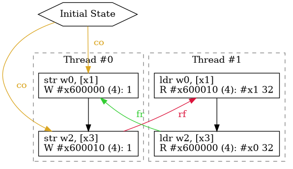

= isla-axiomatic
:toc:

`isla-axiomatic` allows running concurrency litmus tests w.r.t. an
axiomatic memory model specified in the cat language used by
link:https://github.com/herd/herdtools7[herdtools].

== Command line interface

As a simple example the following command will test whether
the test in `MP.toml` is allowed by the model defined in `aarch64.cat`,
using the intra-instruction semantics defined by `armv8p5.ir`,
starting from the initial machine configuration given in `configs/armv8p5.toml`.

[source,bash]
----
target/release/isla-axiomatic -A armv8p5.ir -C configs/armv8p5.toml -m aarch64.cat MP.toml
----

The `-A` option and `-C` options are used to specify the architecture
and the configuration file. The `.ir` file is a compiled
representation of the intermediate representation generated by
Sail. Sample configurations for our models are included
in the isla repository itself, within the configs directory.

TIP: Short options using a capital letter are shared between all isla command line tools.

The `-m` (`--model`) option gives a model specified in the Cat language.

The `-s` (`--timeout`) option sets a timeout in seconds.

The `-e` (`--exhaustive`) option causes the tool to attempt to exhaustively enumerate
all possible executions.

Any files passed on the command line without any options such as
`MP.toml` above specify tests using the TOML-based litmus format
specified below. Multiple files can be passed, e.g. by using `*.toml`
or similar. It can also be specified using the `.litmus` format used
by Herd. If this is the case, `isla-axiomatic` will attempt to invoke
the `isla-litmus` conversion tool automatically. See the section below
on `.litmus` files for more information.

=== Viewing the output

The `--view` flag will cause the output to be displayed as a graphviz
generated graph using `xdg-open` to open an image viewer. The flag
`--dot <path>` will instead generate the dot files used by graphviz in
the directory specified by `<path>`. The `--temp-dot` flag will
generate the dot files in either the default system temporary files
directory (typically `/tmp` on Linux) or in `TMPDIR` if the
environment variable is set. `--view` implies `--temp-dot` unless
`--dot` is used.

If we append `--dot .` to our command in the previous section it will
generate a file `MP_1.dot` in the current directory (if the test had
multiple allowed executions, they would be `MP_2.dot` and so on). We
can then use the `dot` command from graphviz to generate an image,
like so:

[source,bash]
----
dot -Tpng -o MP.png MP_1.dot
----

This will generate the following picture:

=== Comparing with reference results

The `--refs` flag will take a set of reference results produced by
Litmus, Herd, or RMEM, and compare the output with the contents of
that file.

=== Advanced features

The `--ifetch` flag generates additional events for our ARMv8
instruction fetch model. This option primarily changes the base set of
relations and sets available to the Cat memory model. Roughly
speaking, it causes instruction fetch (ifetch) events to be ordered by
fetch-program-order (fpo) and non-ifetch events to be ordered by
regular program order (po). ifetch events are related to regular
events by the (fetch-to-execute) fe relation. The ifetch events will
be in the set `IF`. Additionally there is a weak-coherence-order (wco)
in addition to the normal coherence order, and an
instruction-reads-from (irf) in addition to reads-from.

The `--armv8-page-tables` flag causes page tables to be created.
See xref:translation.adoc[] for full details of support for virtual memory
and address translation for AArch64.

== Litmus input format

The native input file format for isla-axiomatic tests is a
link:https://github.com/toml-lang/toml[TOML] file, with various
specific keys. Below is an example of the ARMv8 MP (message-passing)
test:

[source,toml]
----
arch = "AArch64"
name = "MP"
hash = "211d5b298572012a0869d4ded6a40b7f"
symbolic = ["x", "y"]

[thread.0]
init = { X3 = "y", X1 = "x" }
code = """
	MOV W0,#1
	STR W0,[X1]
	MOV W2,#1
	STR W2,[X3]
"""

[thread.1]
init = { X3 = "x", X1 = "y" }
code = """
	LDR W0,[X1]
	LDR W2,[X3]
"""

[final]
expect = "sat"
assertion = "1:X0 = 1 & 1:X2 = 0"
----

The arch key is technically optional, but in the future may be used to
avoid having to specify the architecture and/or configuration on the
command line. The name key specifies the name of the test, which is
usually the same as the filename, it is mandatory. The hash key is
optional, and is used when the file was converted from a Herd
`.litmus` file.

The symbolic key gives names to virtual addresses. In this test we
have two unknown addresses, x and y, which are provided as a list of strings.

NOTE: `addresses` can also be used as an alternative name for this key

=== Threads

Next the test contains the data for each thread. There is a `thread.N`
section for each thread numbered starting from `thread.0`. The code
key contains the code for each thread - isla-axiomatic does not parse
this code however, and it is directly passed to an assembler. For each
thread `N` its code will be compiled into an ELF section called
`litmus_N`. Where that section is located is determined by the
`[threads]` section of the architecture configuration file:

[source,toml]
----
[threads]
base = "0x400000"
top = "0x500000"
stride = "0x1000"
----

It contains the base address for loading the code for each thread in a
litmus test, and a stride which is the distance between each thread
in bytes. The overall range for thread memory is the half-open range
`[base,top)`. Each thread is therefore located at
`threads.base + (threads.stride * N)`.

The initial state of registers can be set using the init key for each
thread via a table of `register = value` pairs. The register names
must correspond to the register names used in the Sail model (which
may differ to those used by the assembler!). For example, in ARM
assembly the general purpose registers are called X0 to X30 for their
full 64-bit values, and W0 to W30 for their lower 32-bits. In the Sail
model, these registers are represented using registers called R0 to
R30. To facilitate using the assembler names, there is a
`[registers.renames]` section in the configuration which allows for
synonyms to underlying Sail model registers.

An important thing about the init section is it sets the register
values at the beginning of time _before_ any Sail code has been
(symbolically-)executed by the tool. However, this can be problematic,
as often the top-level of a Sail ISA specification looks something
like:

[source,sail]
----
function main() = {
    setup();
    while true {
        fetch_decode_execute();
    }
}
----

Here each register in the init key will be set before `main()`
is run. What happens if `setup()` initialises some registers to
architecturally-defined values? isla allows initialising registers at
an arbitrary user-defined point in time, using the `reset_registers`
builtin. This would be set up in our example model as such:

[source,sail]
----
#ifdef SYMBOLIC
val isla_reset_registers = "reset_registers" : unit -> unit
#else
function isla_reset_registers() -> unit = ()
#endif

function main() = {
    setup();
    isla_reset_registers();
    while true {
        fetch_decode_execute();
    }
}
----

We can now use the reset key in our thread sections, much like the
init key, and the registers will be set when `isla_reset_registers()`
is called.

[source,toml]
----
[thread.0]
reset = { "PSTATE.EL" = "0b00" } # EL0
----

The register keys in the reset table are actually slightly more
general than in init and support setting individual subfields of a
larger Sail register, as is shown above for PSTATE.

NOTE: This is because each key in init must set the entire value of
the register, and cannot leave any parts unspecified. By the time we
call `isla_reset_registers` however, the register already has a value
and we can update only part of it. You might wonder why not use reset
for everything? The answer is that some registers may be used by
`reset()` as _configuration registers_ that specify how the model
should be set up.

WARNING: This is currently called _reset_ due to terminology used in
the ARM specification. We may change the naming at some future point
to make things more clear.

=== Final State

The last section of the file, `[final]` contains the assertion that
the test must satisfy. We can either expect this assertion to be
satisfiable (sat) or unsatisfiable (unsat). The assertion is written
using a small assertion language, specified by the grammar:

[source,grammar]
----
hex = 0x[0-F]+
bin = 0b[0-1]+
nat, thread_id = [1-9][0-9]*

loc ::= thread_id ":" register
      | "*" address

exp ::= loc "=" exp
      | hex
      | bin
      | nat
      | "true"
      | "false"
      | exp "&" exp
      | exp "|" exp
      | "~" exp
      | "(" exp ")"
----

The operators `&`, `|`, and `~` must be parenthesised to remove
ambiguity. There are no implicit precedence rules to ensure
clarity. The `address` terminal can be one of the addresses
specified by the symbolic key at the start of the file, and
`register` must be a Sail register name.

=== Custom sections

The file format also supports custom ELF sections in the generated
litmus test binary, these are specified using a section like so:

[source,toml]
----
[section.thread1_el1_handler]
address = "0x1400"
code = """
     mov x2, #1
     eret
"""
----

The section is called `[section.NAME]` where name will the the name of
the section in the ELF. There is a check to ensure this does not clash
with any of the the generated thread sections. It will be assembled at
the specified address in the generated ELF.

=== Self-modifying code

To constraint the non-determinism for self-modifying code, we must
declare which addresses in the thread's code can be modified and how,
using the `self_modify` toml array:

[source,toml]
----
[[self_modify]]
address = "f:"
bytes = 4
values = [
  "0x14000001",
  "0x14000003"
]
----

Note that the address is a label from the code, which is shown below:

[source,toml]
----
[thread.0]
init = { X1 = "f:", X0 = "0x14000001" }
code = """
        STR W0,[X1]
        BL f
        MOV W2,W10
        B Lout
f:
        B l0
l1:
        MOV W10,#2
        RET
l0:
        MOV W10,#1
        RET
Lout:
"""
----

As can be seen, such labels can also be used as the initial value for
registers, like X1 above.

=== Constrained addresses

Constrained addresses work like the self_modify sections, but allow
restricting the values that are allowed at an address declared in a
litmus file. For example:

[source,toml]
----
symbolic = ["x", "y", "z"]

[locations]
"x" = "z"

[[constrained]]
address = "x"
bytes = 8
values = ["y", "z"]
----

Here we have three addresses `x`, `y`, and `z`. The initial value at
`x` is the address of `z`. The constrained section says the 8-bytes at
this address can only contain the values of `y` or `z`. This
constrains the symbolic execution for all the threads, so we don't get
a blow-up in the number of traces when we use a value read from memory
as an address in one thread.

=== Herd `.litmus` files

Herd has its own custom format for litmus files. To facilitate working
with these files, we include a tool in the github repository
link:https://github.com/rems-project/isla/tree/master/isla-litmus[isla-litmus]
which can convert from Herd's `.litmus` format into the TOML format
described above. This tool is written in OCaml, as it uses the parser
from Herd itself.

== Memory model language

The memory model language is described here xref:memory_model_language.adoc[].

== Linking Sail models with memory models

The previous sections have mostly discussed how the input formats to
the tool look. This section discusses how the events are generated
from the Sail model, and therefore how isla-axiomatic can be
integrated with new Sail ISA models. If you are only interested in
using the tool with existing models, this section is not-necessary,
but might still be useful for understanding how everything fits
together internally.

We can declare the events that are generated by Sail using the
`outcome` keyword in the Sail language. A standard set of these
outcomes covering things like memory accesses, barriers, and so on,
are defined in the Sail library in the `lib/concurrency_interface`
folder. Arbitrary Sail types can be put in these outcome types, and
extracted by the memory model language (see the section on that
above).

There are some other builtins we must add to our ISA specification to
ensure the concurrency model works correctly. The
`+__branch_announce+` builtin informs the model about the addresses
used by branch instructions. This is used for computing control
dependencies (the `ctrl` relation in Cat). For example, the
BranchToAddr function in the ARMv8 model contains:

[source,sail]
----
function BranchToAddr (target, branch_type) = {
    Hint_Branch(branch_type);
    if 'N == 32 then {
        assert(UsingAArch32());
        __branch_announce(64, ZeroExtend(64, target));
        _PC = ZeroExtend(target)
    } else {
        assert('N == 64 & ~(UsingAArch32()));
        __branch_announce(64, slice(target, 0, 64));
        _PC = slice(target, 0, 64)
    };
    __PC_changed = true;
    return()
}
----

We can't just rely on writes to the program counter (`_PC`) because
other instructions may write to it, but not be involved in the `ctrl`
relation.

The `+__instr_announce+` builtin is used to tell the concurrency model
which instruction is being executed each cycle, allowing events to be
associated with the instruction that executed them. This should happen
directly after the instruction is fetched from memory. It is very
important that the top level fetch-decode-execute loop in Sail
increments the cycle counter (via the `"cycle_count"` builtin) so each
instruction announce event is associated with the right set of
events. A minimal example in Sail might look something like:

[source,sail]
----
val __cycle_count = "cycle_count" : unit -> unit
val __monomorphize = "monomorphize" : forall 'n, 'n >= 0. bits('n) -> bits('n)

function main() -> unit = {
    setup();
    __cycle_count();
    while true {
        instr = __monomorphize(fetch());
        __instr_announce(instr);
        decode_and_execute(instr);
        __cycle_count()
    }
}
----

NOTE: Cycle 0 (before the first call to `+__cycle_count+`) is reserved for initialization.

Notice the use of the `+__monomorphize+` builtin here. This is a
special builtin that is a no-op in all other Sail backends, but in
Isla forces the symbolic execution to case-split on the value of its
argument if the argument is symbolic. This means that `instr` is
forced to always be a concrete value in `+__instr_announce+`.

=== Dependency analysis

The axiomatic concurrency models depend on _syntactic dependencies_
between instructions. In a perfect world this information would be
provided to us explicitly as part of the architecture specification,
but as large imperative ISA specifications have not typically been
integrated with concurrency tools such as Isla, this is not the case
in the real world at present.

The dependency relations we need are:

* *addr* We get an address dependency from a load to a store or load when the address of the store or load depends on the value of the first load.

* *data* We get a data dependency from a load to a store when the data of the store depends on the value read by the load.

* *ctrl* We get a control dependency from a load to every event after a branch when the branch's address depends on the value read by the load.

We have a way to derive sensible syntactic dependencies from
the semantics of instructions. This may seem odd - how can one derive
_syntactic_ dependencies from _semantics_?  The assumption here is
that the syntax itself should determine all the possible behaviours, so
if we use symbolic execution to explore all the possible behaviours of
an instruction in any starting state, we should end up with the
correct syntactic dependencies.

NOTE: It is neither correct to under-approximate or
over-approximate these dependencies, they must be
exact. Under-approximating would allow bad executions, and
over-approximating would forbid good ones.

The approach is roughly as follows: for each instruction in the litmus
test we execute it in an unconstrained starting state. This produces a
set of all the possible behaviours of the instruction. We then look at
those behaviours and track which registers were tainted by data read
from memory, as well as what registers flow into store, load, and
branch addresses. Using this information we can then compute the addr,
data, and ctrl relations in a straightforward way.

The `isla-footprint` command with the `-d`(`--dependency`) option can
be used to view the information generated by this process:

[source,bash]
----
isla-footprint -A aarch64.ir -C configs/aarch64.toml -i "ldr w0, [x1]" -d
----

generates:

[literal]
opcode: #xb9400020
Execution took: 159ms
Footprint:
  Memory write:
  Memory read: R0
  Memory address: R1
  Branch address:
  Register reads: TCR_EL1 SCR_EL3 PSTATE.EL SCTLR_EL1 __defaultRAM CFG_ID_AA64PFR0_EL1_EL3 EDSCR __CNTControlBase OSLSR_EL1 PSTATE.D R1 OSDLR_EL1 CFG_ID_AA64PFR0_EL1_EL1 CFG_ID_AA64PFR0_EL1_EL0 CFG_ID_AA64PFR0_EL1_EL2 PSTATE.nRW DBGEN __highest_el_aarch32
  Register writes: __LSISyndrome R0
  Register writes (ignore):
  Is store: false
  Is load: true
  Is exclusive: false
  Is branch: false

Some registers in the Sail ARM model aren't really architectural
registers and should be ignored for dependency analysis, these can be
added to `registers.ignore` in the architecture configuration. Usually
in ASL and therefore the ARMv8 Sail, these are prefixed by two
underscores.

Unfortunately it is sometimes possible that this process doesn't give
us exactly the dependencies we need. There are two special builtins

[source,sail]
----
val __mark_register = "mark_register" : forall ('a: Type). (register('a), string) -> unit
val __mark_register_pair = "mark_register_pair" : forall ('a: Type) ('b: Type). (register('a), register('b), string) -> unit
----

That allows annotating registers with information (in the form of a string) at specific points during symbolic execution, for example:

[source,sail]
----
__mark_register_pair(ref R0, ref R1, "ignore_edge")
----

will cause read-write edges from R0 to R1 to be ignored,
"ignore_write" can also be used with a single register to ignore all
read-write edges into a register.

NOTE: We use the `ref register` syntax in Sail to pass the registers by name to this builtin.

=== Dependency analysis for systems semantics

While the notions of address, data, and control dependencies seem
simple enough for user-mode concurrency, things become more unclear when
we start thinking about systems features. For example: What if an
instruction behaviour changes between exception levels? Should we
included dependency information generated at all exception levels?
Does dependency information cross between exception level boundaries?
How does the MMU and address translation affect this?

In truth it seems syntactic dependencies are bit of a fuzzy concept
once we start thinking at this level. In practice when we have the MMU
enabled we can make instruction execution so non-deterministic that it
becomes computationally infeasible to evaluate all paths through an
instruction without abstracting away features. To work around these
issues in systems tests, we have a `--footprint-config` option for
`isla-axiomatic` that allows a separate architecture configuration to
be used during dependency analysis.
