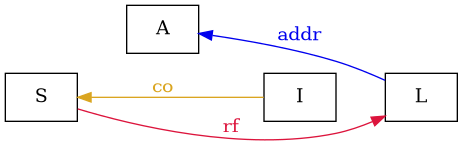
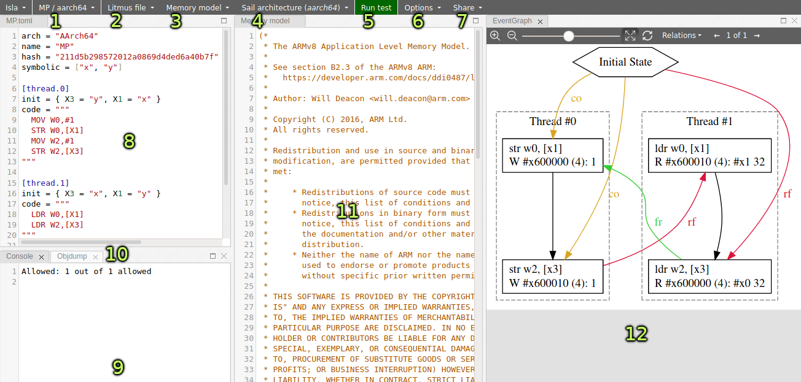

# Overview

Isla is a symbolic execution engine for
[Sail](https://www.cl.cam.ac.uk/~pes20/sail/). It executes instruction
set architecture (ISA) specifications written in Sail, such as our
[ARMv8 model](https://github.com/rems-project/sail-arm) translated
from ARM's [machine readable
specification](https://developer.arm.com/architectures/cpu-architecture/a-profile/exploration-tools),
or [Sail RISC-V](https://github.com/rems-project/sail-riscv).

Isla-axiomatic then combines these specifications with axiomatic
memory models written in a subset of the cat language used by the [diy
tool suite](http://diy.inria.fr/) (and in particular the memory model
simulation tool [herd7](http://diy.inria.fr/doc/herd.html)), with an
SMT solver like [z3](https://github.com/Z3Prover/z3) (used by this web
interface) or [CVC4](https://cvc4.github.io/).

# Rust API documentation

API documentation for the latest version published on
[crates.io](https://crates.io/crates/isla-lib) is available on
[docs.rs](https://docs.rs/isla-lib/0.2.0/isla_lib/).

Local documentation can be generated and viewed via:

```
cargo doc --open
```

# Tool options

## Shared options

All the Isla executables share some common options, which are described below:

- `-A <file.ir>` specify a Sail architecture as a `.ir` file. See
  [here](https://github.com/rems-project/isla-snapshots) for
  pre-compiled versions of our various Sail architectures.

- `-C <file.toml>` specify a configuration file for an architecture. The `configs`
  sub-directory of this repository contains various example
  configurations.
  
- `-T <n>` use this many worker threads. Defaults to the number of
  available CPU cores.
  
- `-I <register = value>` set the initial value of a register at the beginning of time,
  before any Sail initialisation code occurs

- `-R <register = value>` set a register value after Sail initialisation occurs.

- `-D <flags>` set debugging flags. For example, `-D f` will print information
  about forks (places where control flow diverges) in the symbolic
  execution. The various options are:
  
  - `f` Print information about control flow forks
  
  - `m` Print information about memory accesses
  
  - `l` Print information while compiling litmus tests (isla-axiomatic specific)
  
  - `p` Print probe information (see `--probe` flag)
  
  The above options can be passed together, e.g. `-D fmp`
  
- `--probe <function id>` Will print information when calling or
  returning from the specified function, provided the `-D p` flag is
  set.
  
- `--debug-id` Sometimes the `--probe` flag will display identifiers as
  interned symbols (which are just unsigned 32-bit numbers). This
  option takes such a symbol number and prints it's original Sail
  name, before exiting immediately.
  
- `--help` Print usage information for the command
  
- `--verbose` Print extra information during execution

- `-L` Linearise a function. See the function linearisation section of this document.

- `--test-linearize` After linearising a function, using the SMT
  solver to check the linearised version is equivalent to the
  original.

### Function linearisation

Isla always creates a new task when we hit a branch, and does not ever
merge these tasks at join points. This is a good strategy for
instruction semantics, as it simplifies the symbolic execution engine
significantly, but it does mean some code can cause unnecessary
branching. To avoid this there is a static rewrite that can take a
function with if statements and rewrite it into a _linear_ form, for
example:

```
var x = 2;
if undefined {
  x = x + 1
} else {
  x = x + 2
};
return x
```

would become:

```
let x0 = 2;
let b = undefined;
let x1 = x0 + 1;
let x2 = x0 + 2;
let x3 = ite(b, x1, x2);
return x3
```

Ordinarily the `if` statement (with a symbolic argument generated by
the `undefined`) in the original Sail would cause the control flow to
split and two symbolic execution tasks would be created for each
branch. In the second version, both branches of the if are evaluated
and we will have a single SMT problem with an internal `ite` SMT
expression.

Some caveats: This rewrite causes both branches of any if statement to
be executed, so this rewrite can change the observable side effects of
a function when applied to non-pure functions. More subtly, Sail has
flow-sensitive typing so the types in one branch may be unsound in the
case where the other branch is taken - this sounds bad, but is
actually ok, provided we make sure we define each primitive to return
dummy values when it is called on values which would ordinarily be
forbidden by its type (if this is not the case, then we just get an
error rather than any kind of unsoundness). Finally, this rewrite does
not support functions with loops.

## isla-footprint

`isla-footprint` prints simplified instruction opcode summaries and dependency information, e.g.

```
$ target/release/isla-footprint -A aarch64.ir -C configs/aarch64.toml -i "add x0, x1, #3" -s
opcode: #x91000c20
Execution took: 80ms
(trace
  (declare-const v7 (_ BitVec 32))
  (assert (= (bvor #b0 ((_ extract 0 0) (bvlshr (bvor (bvand v7 #xfffffffe) #x00000001) #x00000000))) #b1))
  (branch-address #x0000000010300000)
  (declare-const v3370 (_ BitVec 64))
  (define-const v3371 v3370)
  (cycle)
  (read-reg |SEE| nil (_ bv-1 128))
  (write-reg |SEE| nil (_ bv1066 128))
  (write-reg |__unconditional| nil true)
  (read-reg |__v85_implemented| nil false)
  (read-reg |R1| nil v3371)
  (define-const v3457 (bvadd ((_ extract 63 0) ((_ zero_extend 64) v3371)) #x0000000000000003))
  (write-reg |R0| nil v3457))
```

The `-i` option specifies an instruction which is compiled to a single
concrete opcode using the assembler specified in the configuration
file. The `-x` option can be used to pass a hexadecimal opcode
directly rather than relying on an assembler. This hexadecimal opcode
can either be little or big endian, which is controlled by the `-e`
option.

The `-s` flag tells the tool to apply some basic simplification rules
to the output, without which it can be extremely verbose.

This tool prints the instruction summary in a S-expression format
based on [SMTLIB](http://smtlib.cs.uiowa.edu/), which contains an
ordinary SMT formula built from `declare-const`, `define-const`, and
`assert` commands, as well as _effects_ such as `read-reg` and
`write-reg` above that denote which parts of the SMT formula
correspond to various actions taken by the Sail model.

The various effects are:

- `branch <counter> <variable> <sail location>` denotes a symbolic
  execution control flow split. The arguments are a counter that is
  incremented every control flow fork, the symbolic (boolean) variable
  that caused control flow to split, and the location of the control
  flow construct in the original Sail source code.

- `read-reg <name> <accessors> <value>` a register read, arguments are
  the name of the register, any accessors e.g. `.EL` in `PSTATE.EL`,
  and the value read.
  
- `write-reg <name> <accessors> <value>` a register write. Arguments
  are the same as for read, except `<value>` is the value written.

- `read-mem <return value> <read kind> <address> <bytes> <tag value>`
  is a memory read. Arguments are the value read from memory, the read
  kind which is a member of the sail `read_kind` enumeration, the
  address, the number of bytes read, and a tag value (for CHERI tagged
  memory).

- `write-mem <return value> <write kind> <address> <data> <bytes> <tag
  value>`. Arguments are the same as for memory read except there is
  an extra `<data>` argument specifiying the data written. The return
  value is a boolean specifying if the write succeeded. The write kind
  is a member of the Sail `write_kind` enumeration.

- `branch-address <address>` An event announcing the address of a branch
  instruction. Used when computing control dependencies in the
  concurrency model.
  
- `barrier <barrier kind>` A barrier event. The barrier kind is a
  member of the Sail `barrier_kind` enumeration.
  
- `cache-op <cache op kind> <address>` A cache maintenance
  operation. The cache op kind is a member of the Sail `cache_op_kind`
  enumeration.
  
- `mark-reg <registers> <string>` An event that can be used to tag
  some registers with additional instrumentation. In Sail this would
  be generated by a function call of the form:
  
  ```
  __mark_register(ref R0, "mark")
  ```
  
  which would create an event marking R0 with the string
  `"mark"`. There are other Sail functions that allow marking multiple
  registers simultaneously if needed. Currently this information is
  used to provide extra hints to the footprint dependency analysis
  stage in the concurrency model.
  
- `cycle` Denotes the start and end of a fetch-decode-execute
  cycle. The first cycle is reserved for initialisation.
  
- `instr <opcode>` Announces each fetched opcode.

If the configuration file enables the MMU, then we need valid page
tables in memory. The `--identity-map <virtual address>` flag creates
a valid identity mapping and page tables for ARMv8. It can be passed
multiple times to create mappings for multiple virtual addresses.

The `-d` option changes the behaviour of the command to instead print
dependency information rather than trace summaries. For example:

```
$ target/release/isla-footprint -A aarch64.ir -C configs/aarch64.toml -i "add x0, x1, #3" -d
opcode: #x91000c20
Execution took: 71ms
Footprint:
  Memory write:
  Memory read:
  Memory address:
  Branch address:
  Register reads: R1
  Register writes: R0
  Register writes (ignore):
  Is store: false
  Is load: false
  Is exclusive: false
  Is branch: false
```

## isla-axiomatic

`isla-axiomatic` allows running concurrency litmus tests w.r.t. an
axiomatic memory model specified in the cat language used by
[herdtools](https://github.com/herd/herdtools7).

For example, the following command will test whether the LB test is
allowed by the aarch64.cat memory model (both of which are included in
our web interface, hence the filepaths in the command).

```
target/release/isla-axiomatic -A aarch64.ir -C configs/aarch64.toml -m web/client/dist/aarch64.cat -t web/client/dist/aarch64/LB.toml
```

The `--view` flag will cause the output to be displayed as a graphviz
generated graph using `xdg-open` to open an image viewer. The flag
`--dot <path>` will instead generate the dot files used by graphviz in
the directory specified by `<path>`.

For the above example this will generate the graph:


isla-axiomatic allows comparing against the output from RMEM or Herd
using the `--refs` flag which allows supplying reference results.

The `-e` flag forces isla-axiomatic to generate all possible executions.

A separate configuration can be passed for dependency analysis using
the `--footprint-config` flag.

### Instruction-fetch and page tables support

The `--ifetch` flag causes isla-axiomatic to generate instruction
fetch events, as per our [ESOP2020
paper](https://link.springer.com/chapter/10.1007%2F978-3-030-44914-8_23).

The `--armv8-page-tables` causes ARMv8 pages tables to be created and
maps the code from the litmus tests into the page tables.

### Batch use

The executable has various options that allow batch use, allowing
setups where we run a certain number of tests concurrently with each
test having access to a certain number of cores. There are scripts in
the root of this repository such as `test_litmus_aarch64.sh` which
demonstrate how this is used.

## isla-axiomatic web interface

Rather than running isla-axiomatic locally, an online version is
available [here](https://isla-axiomatic.cl.cam.ac.uk/). The web
interface can also be run using a local web server, see the Makefile
in the `web` sub-directory for how this is done. Note that while we try
to support MacOS for the rust library and associated executable tools
the web interface only works under Linux.

### User interface



1. The test/model dropdown provides a list of the currently open tests
   and their memory models. When a new litmus test or memory model
   definition is opened it will appear in this dropdown menu.
   
2. The litmus file dropdown provides options for opening litmus files
   and creating new litmus files. It also provides access to a
   pre-existing library of tests.
   
3. The memory model dropdown allows choosing the memory model to be used.

4. The architecture dropdown allows switching between ARMv8 mode and
   RISC-V mode.
   
5. The run test button runs the current litmus test with the selected
   model, showing an execution graph in (**12**) if the test is
   allowed. If the test is forbidden (or allowed) this will be shown
   in (**9**).
   
6. Allows setting addition options. Currently instruction fetch reads
   can be ignored (although they should not be ignored when using the
   ESOP2020 ifetch model), and it allows filtering out irf edges from
   the initial state in the ESOP2020 ifetch tests, as they can clutter
   the graph.
   
7. Allows creating a link to a snapshot of the interface state.

8. The concurrency litmus test, which can be edited.

9. A log of test results and feedback.

10. This tab shows the assembled machine code for the litmus test.

11. The editable memory model specified in the cat language. See below for a
    description of this language.

12. A graph of the execution, generated by (**5**). Relations can be
    toggled on and off by via the relations dropdown. If there are
    multiple valid executions, they can be switched between using the
    arrows in the top right.

### Litmus file format

The default litmus file format is a
[TOML](https://github.com/toml-lang/toml) file with a specific format
described below. The `.litmus` files as used by herd7 are also
supported.

It starts with two key value pairs for the name of the test and the
(symbolic) address variables used. The `symbolic` key must be present,
although `symbolic = []` can be used if there are no such
addresses. Note that this web interface currently always allocates (at
least) 4-byte aligned concrete addresses to these variables where the
memory values pointed to by these addresses are always symbolic. Other
key/value pairs at the top of the file header are optional. For
example:

```
name = "MP"
symbolic = ["x", "y"]
```

Next comes a sequence of threads, e.g.

```
[thread.0]
init = { X3 = "y", X1 = "x" }
code = """
	MOV W0,#1
	STR W0,[X1]
	MOV W2,#1
	STR W2,[X3]
"""
```

These should be named `[thread.0]`, `[thread.1]`, `[thread.2]` etc, in
increasing order. They each contain two key/value pairs, `init` and
`code`. The `init` key describes the initial state of registers for
that thread. The register can be any bitvector typed register
specified in the underlying Sail model. In addtion some synonyms are
allowed, so `Xn` and `Wn` can be used for the underlying `Rn`
registers on ARM. Values can be symbolic addresses like `"x"` or
`"y"`, hexadecimal or decimal values e.g. `X1 = "1"` or `X5 =
"0x14000001"`, or labels in the assembly source e.g. `X2 = "g:"`. Note
that all values should be passed as quoted strings.

The code section contains assembly code for each thread as a
string. TOML's multiline string notation with triple-quotes is used to
split this over multiple lines.

Lastly the `[final]` section contains information about the expected
final state of each test.

```
[final]
assertion = "1:X0 = 1 & 1:X2 = 0"
```

The only mandatory key here is `assertion`. An `expect` key can also
be used with a hint about whether the underlying SMT problem should be
`sat` or `unsat`, but this is not currently used by the web interface.

The assertion is specified as a boolean expression format, where
`<thread>:<register> = <value>` can be used to specify the final state
of any register in the Sail model. The `<thread>` corresponds to the
number `n` in the various `[thread.n]` sections.

The form `<address> = <value>` can also be used to write assertions
that talk about the last written value to an address, which is
typically a symbolic address from the litmus file like `"x"` or `"y"`.

### Cat language for specifying memory models

The cat language is described in detail
[here](http://diy.inria.fr/doc/herd.html#herd%3Alanguage) as part of
the herd7 documentation.

cat has some features which are not easy (or even possible at all) to
translate into SMT. Roughly-speaking, we support the fragment of cat
that defines sets and relations over events. More formally the
fragment of cat we support is defined by the grammar:

```
expr ::= 0
       | id
       | expr? | expr^-1
       | ~expr
       | [expr]
       | expr | expr
       | expr ; expr | expr \ expr | expr & expr | expr * expr
       | expr expr
       | let id = expr in expr
       | ( expr )

binding ::= id = expr

closure_binding ::= id = expr^+
                  | id = expr^*

id ::= [a-zA-Z_][0-9a-z_.-]*

def ::= let binding { and binding }
      | let closure_binding
      | include string
      | show expr as id
      | show id {, id }
      | unshow id {, id }
      | [ flag ] check expr [ as id ]

check ::= checkname | ~checkname

checkname ::= acyclic | irreflexive | empty
```
