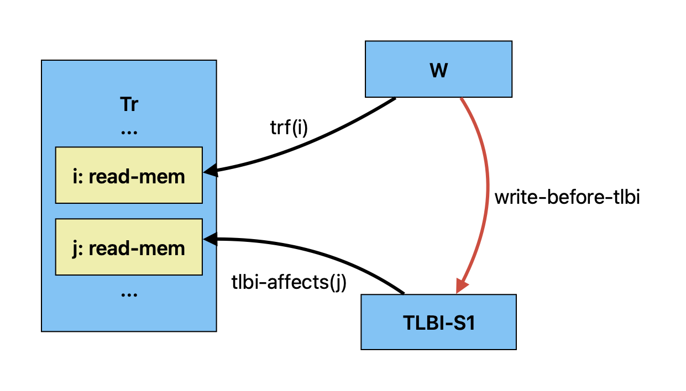

= Isla memory model language
:toc:

== Overview

The memory model language used by isla-axiomatic is based on the cat
language used by link:http://diy.inria.fr/doc/herd.html[Herd]

The basic relational operators are mostly the same as in cat: We have
`|` for union, `;` for relational composition, `&` for intersection,
`\\` for difference, and `*` for the cartesian product.

Documentation on the full cat language can be found at:
http://diy.inria.fr/doc/herd.html#herd%3Alanguage

The postfix operators are `^+`, `^*`, and `^-1` for transitive
closure, reflexive-transitive closure, and the inverse of a
relation. As in cat, `R?` is the union of the relation `R` and the
identity relation.

Much like in cat the `[S]` operator will lift a set `S` to the
identity relation over `S`.

We support arbitrary N-ary relations, and the various operators are
defined to work on N-ary relations (and sets) where appropriate.

As an example, see the dependency-ordered-before (dob) relation in the
Arm model:

[source,mml]
----
let dob = addr | data
	| ctrl; [W]
	| (ctrl | (addr; po)); [ISB]; po; [R]
	| addr; po; [W]
	| (ctrl | data); coi
	| (addr | data); rfi
----

Cat has some features which are not easy (or even possible at all) to
translate into SMT. Roughly-speaking, we support the fragment of cat
that defines sets and relations over events. More formally the
fragment of cat we support is defined by the grammar:

[source,grammar]
----
expr ::= 0
       | id
       | expr?
       | expr^-1
       | expr^+
       | expr^*
       | ~expr
       | [expr]
       | expr "|" expr
       | expr ; expr
       | expr \ expr
       | expr & expr
       | expr * expr
       | expr expr
       | let id = expr in expr
       | ( expr )

binding ::= id = expr

id ::= [a-zA-Z_][0-9a-z_-]*

def ::= let binding
      | include string
      | show expr as id
      | show id {, id }
      | [ flag ] check expr [ as id ]

check ::= checkname | ~checkname

checkname ::= acyclic | irreflexive | empty
----

== Extensions to Cat

=== SMTLIB types

The type of events is denoted `Event`. The boolean type is `bool` with
members `true` and `false`. In addition we allow bitvectors, denoted
using the Sail-style syntax `bits(N)` for some postive integer
`N`. Bitvector literals are written as they are in Sail, as either
`0x[A-Fa-f0-9]+` or `0b[01]+` for hexadecimal and binary
respectively. The number of digits gives precisely the width of the
bitvector, so `0xABC` has a width of 12. As in SMT, zero-width
bitvectors are not supported.

For bitvectors the SMT operations from
https://smtlib.cs.uiowa.edu/theories-FixedSizeBitVectors.shtml can all
be used, with a C/Sail-style function application syntax
e.g. `bvlshr(0xA0, y)` to logically shift `0xA0` right `y` times. The
syntax `x[hi .. lo]` can also be used to create a slice of the
bitvector `x` from the bit `hi` down to the bit `lo` (inclusive). Both
`hi` and `lo` must be constants.

We also allow using enumerations. Currently enumerations can be
declared in the memory model file using the same syntax as Sail:

[source,mml]
----
enum Barrier = Barrier1 | Barrier2

(* Or alternatively *)
enum Barrier = {
  Barrier1,
  Barrier2
}
----

in the future it should be
possible to import these enumerations from the Sail model
automatically.

These additions extend the grammar as follows:

[source,grammar]
----
expr ::= id ( expr {, expr } )
       | 0x[A-Fa-f0-9]+
       | 0b[01]+
       | ...

ty ::= id
     | bits ( [1-9][0-9]* )

enum_def_bar ::= id
               | id | enum_def_bar

enum_def_comma ::= id 
                 | id , enum_def_comma

def ::= enum id = enum_def_bar
      | enum id = "{" enum_def_comma "}"
      | ...
----

=== SMTLIB style definitions

We compile our memory model definitions directly into SMT, and we
allow lower-level pointwise definitions rather than the more
high-level point-free style of cat. The top-level construct `define`
can be used to write definitions such as:

[source,mml]
----
define is_dmb_ld(ev: Event): bool = is_dmb(ev) & (barrier_types(ev) == MBReqTypes_Reads)
----

`declare` is similar but it'll declare an uninterpreted function or
constant, so we don't provide a function body or name the parameters.

[source,mml]
----
declare is_dmb_ld(Event): bool
----

These constructs will be lowered straightforwardly into corresponding
define-const, define-fun, declare-const, and declare-fun constructs in
the SMT output.

For an `Event` set S, we can use it like a function `Event` to `bool`,
applying it like a function `S(ev)` for some event `ev`. We can use
`_` to partially apply relations, so `R(a, _)` would be the set `{b |
R(a, b)}`.  We can also use the `relation`, `set`, `forall`, and
`exists` keywords to drop-down into a pointwise style where
appropriate, so in the above dob declaration, we could (somewhat
pointlessly) write:

[source,mml]
----
let dob = (relation a, b => addr(a, b)) | data
        | ...
----

We can also use the `in` keyword like `ev in S` to test if `ev` is in
the set `S`.

Finally, in addition to the usual acyclicity, irrefexivity, and
emptiness constraints allowed by Herd we support an `assert` keyword
that allows arbitrary SMT assertions for each candidate
execution. With these features we can write anything that is
expressible in the SMT theory of bitvectors+quantifiers.

The grammar is extended to support these constructs as follows:

[source,grammar]
----
param ::= id [: ty]

expr ::= expr in expr
       | relation param , param => expr
       | set param => expr
       | forall param {, param } => expr
       | exists param {, param } => expr
       | ...

def ::= define id ( param {, param } ) : ty = expr
      | define id : ty = expr
      | declare id ( ty {, ty } ) : ty
      | declare id : ty
      | assert expr
      | ...
----

Note that whenenver a parameter type is omitted it is assumed to have
type Event.

== Extracting values from the Sail model.

Values can be extracted from the Sail model by using _accessors_. The
possible outcomes/events of the model are declared in the Sail library
(in `lib/concurrency_interface`) of the Sail model. As an example, the
outcome declaration for a barrier looks like:

[source,sail]
----
outcome sail_barrier : 'barrier -> unit
with
  'barrier : Type
----

The idea here is that the outcome declarations are part of the Sail
library, and therefore shared between the various ISA models, but the
type variables such as `'barrier` above can be instantiated with
architecture-specific types in each ISA model.

[source,sail]
----
enum Barrier = Barrier1 | Barrier2

// from lib/option.sail
union option('a: Type) = {
  Some : 'a,
  None : unit
}

instantiation sail_barrier with
    'barrier = option(Barrier)
----

=== Inline accessors

Simple accessors are used inline. For example, for an memory read or
write event `ev`, we can access its address using `ev.address()`. If
we wanted to access just the lower 16 bits of the address we could use
`ev.address()[16 .. 0]`.

Internally the accessor `.address()[16 .. 0]` will be compiled to a
SMT function from `Event` to `(_ BitVec 16)`. All functions in SMT
must be total, so if the accessor does not make sense for the event we
will end up with a default value.

The grammar for accessors is as follows:

[source,grammar]
----
nat ::= [1-9][0-9]*

field_accessor ::= 0x[A-Fa-f0-9]+
                 | 0b[01]+
                 | id
                 | self
                 | default
                 | accessor

match_arm ::= id => field_accessor

dot_accessor ::= id accessor
               | match "{" match_arm {, match_arm} "}"
               | extz ( nat )
               | exts ( nat )
               | length ( nat )
               | address()
               | data()
               | nat

accessor ::= "[" nat .. nat "]"
           | is id
           | . dot_accessor {accessor}

expr ::= expr accessor
----

=== Named accessors

For more complex cases, we can create named accessor functions using
the following extension to the cat grammar:

[source,grammar]
----
def ::= accessor id : ty = accessor
      | ...
----

Going back to our example above with the `sail_barrier` outcome. In
the memory model we can declare some predicates and relations to work
with this type:

[source,mml]
----
enum Barrier = Barrier1 | Barrier2

accessor is_some: bool = .match { Some => true, None => false }
accessor unwrap_some: Barrier = .match { Some => self, None => default }

define is_barrier(ev: Event, b: Barrier): bool =
    ev is sail_barrier & is_some(ev) & (unwrap_some(ev) == b)

let barriered = instruction-order; [is_barrier(_, Barrier2)]; instruction-order

(* We could equivalently write *)
let barriered2 = instruction-order; [set b => is_barrier(b, Barrier2)]; instruction-order
----

Here we see the use of the `.match` accessor to destructure a Sail
option type. As mentioned, each accessor will generate a total
function over events, so we need to use both the `is_some` and
`unwrap_some` function to define the `is_barrier` predicate -- without
using `is_some`, `unwrap_some` would return a default value of type
`Barrier` when `ev` is `None`. We also use the `is` keyword to ensure
that the event is really a `sail_barrier` event -- it could be the case
we have some other outcome event instantiated with a compatible option type.

Notice that all our accessors are written postfix in a point-free
style. Rather than

[source,mml]
----
match x { Some(y) => y.field, None => default }
----

we instead write

[source,mml]
----
x.match { Some => .field, None => default }
----

If we want the equivalent of `Some(y) \=> y`, we use the `self` keyword in a
match arm, as shown in the example above.

Other Sail types are destructured as follows:

* The first element of a tuple `t` can be accessed as `t.0`, with
  `t.1`, `t.2` and so on for the subsequent elements.

* A bitvector `bv` can be sliced as `bv[n .. m]` where `n` and `m` are inclusive indices where `n >= m`.

* A bitvector `bv` can be zero-extended to a length `n` as `bv.extz(n)`, and sign-extended using `bv.exts(n)`.

* `bv.length(n)` will filter any bitvectors that do not have a length of exactly `n`.

* A struct `s` can have its fields accessed using the `s.field`
  syntax. Note that this means that identifiers with dots in them are
  forbidden in our variant of the cat language.

* `.address()` and `.data()` will return the address and data values
  for memory reads and writes. These are treated somewhat specially
  because Isla needs to know about them for symbolic execution.

== Indexed Relations (experimental)

By default, each event in the execution graph corresponds to a single
event generated by the Sail model (as described by the outcomes in the
interface). So a single memory access becomes a unique node in the
graph, as does each fence, system register access (when selected for
inclusion in the graph), and so on. This has two main issues:

* It results in graphs with an excessively large number of events,
  resulting in poor performance.

* It can lead to excessively complex models, as one gets lost in the
  mass of edges between the overly fine-grained events, obscuring the
  higher level design principles behind the model.

A example of this is in models for address translation. Generating a
separate event for every read in a translation table walk quickly
explodes, as (in Arm) there can be up to 24 page table memory accesses
for every regular memory access.

Isla allows avoiding this by creating graph events that correspond to
a sequence of many trace events, while still allowing us to access the
data from those events if required. We do this by creating an _index
type_ that allows us to map into the sequence of trace events, for
example:

[source,mml]
----
index T
----

This declares a natural number `T`, such that the type `bits(T)` can
be used to index the underlying trace events making up a single
axiomatic event. Isla will automatically pick the smallest value
possible for this index.

This number can be used when declaring _indexed accessors_. For the
rest of this section we will assume that we are working with
translation events that contain a sequence of memory read
events. Let's assume these memory read events contain a `translation`
field, which in turn contains a struct with various information about
the state of the page table walk where they were issued. Here we
assume that there is a stage field telling us if an access is in the
stage 1 or stage 2 tables:

[source,mml]
----
enum Stage = S1 | S2

accessor translation-stage[T]: bits(2) = .translation.stage
----

Assume we have a graph that looks something like:

Here we have a translation event (in set `Tr`), a memory write (`W`),
and a stage 1 TLB invalidate (`TLBI-S1`). We define a `i`-indexed
relation `tlbi-affects` that relates `TLBI` events to `Tr` events if
the trace sub-event `i` shares the same stage with the TLB
invalidate. We assume also that the built-in relation `trf`
(translation reads-from) is defined similarly.

[source,mml]
----
define TLBI-S1(tlbi: Event): bool = tlbi.stage = S1

define tlbi-affects(i: bits(T), tlbi: Event, t: Event): bool =
  Tr(t) & TLBI(tlbi) & tlbi.stage == translation-stage(i, t)
----

Now we want to define the `write-before-tlbi` relation in red. How can
we do this? We can use a `where exists` clause to combine a standard
cat-style relational definition using `let`, with an additional
constraint that the `trf` index must be less than the `tlbi-affects`
index. Since the indices are bitvectors, we can use the SMT function
`bvult` (**b**it**v**ector **u**nsigned **l**ess **t**han) for this.

[source,mml]
----
let write-before-tlbi =
    trf(i); tlbi-affects(j)^-1
  where
    exists i: bits(T), j: bits(T) => bvult(i, j)
----
