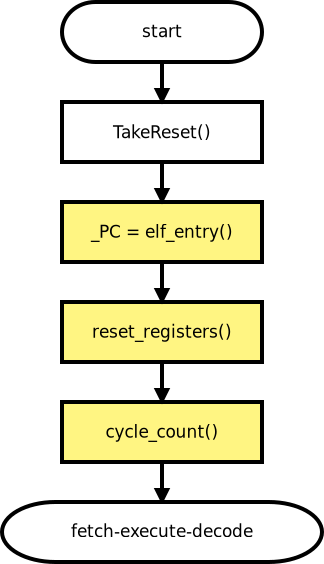
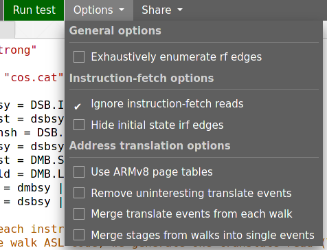
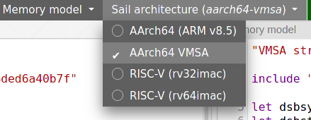
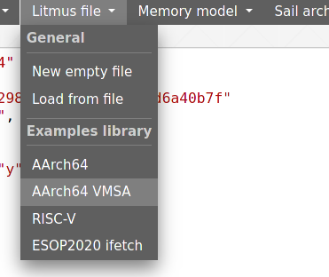

= Isla for virtual memory tests
:toc:

This document describes the features of Isla applicable to writing and
running virtual memory litmus tests in isla-axiomatic. It covers the
DSL used to specify page table configurations, enhancements to the
initial state description in tests for virtual memory and address
translation, and options to control how Isla generates and treats
translate read events. Finally, an example is given of how Isla can be
used to test more than just strictly memory models, via a simple
break-before-make detection example, and some tips for debugging
virtual memory tests are given.

== Page table setup language
 
For each litmus test the configuration for the in-memory page tables
are specified using the `page_table_setup` key of the toml litmus test
format. For example, the following is the beginning of a particularly
simple virtual memory litmus test that contains a single virtual
address `x`, which is mapped to some physical address `x`.
 
[source,toml]
----
arch = "AArch64"
name = "W"
addresses = ["x"]

page_table_setup = """
    physical pa1;
    x |-> pa1;
""" 
----

=== Declaring addresses

The `addresses` field declares virtual addresses. In non-translation
tests where `page_table_setup` is not used, this is used for all
addresses. It assigns addresses in a deterministic way using the
architecture configuration, where address `i` in the list of addresses
is defined as `symbolic_addrs.base + (symbolic_addrs.stride * i)`.

Additional addresses are defined in the `page_table_setup` key, using
the `virtual`, `physical`, and `intermediate` keywords. For example:

[source]
----
virtual x y z;
intermediate ipa1 ipa2;
physical pa1 pa2;
----

would define three virtual addresses `x`, `y`, and `z`; as well as two
intermediate physical addresses `ipa1` and `ipa2`; and two physical
addresses `pa1` and `pa2`. By default the addresses generated by each
of these three lines are guaranteed to be disjoint, and aligned by
`symbolic_addrs.stride` bytes from the architecture config. If it is
required that the two addresses should not be disjoint, then they can
be declared separately, for example the following will declare `x` and
`y`, where both can have the same address. Note that they are not
_required_ to have the same address unless additional constraints are
used.

[source]
----
virtual x;
virtual y;
----

Custom alignment requirements can be specified in the following way:

[source]
----
aligned 4096 physical pa1 pa2;
----

will require that `pa1` and `pa2` are disjoint and 4K aligned.

Constraints upon addresses can be specified using the `assert` keyword, for example

[source]
----
virtual x;
virtual y;
assert x == y;
----

will require that the the two addresses in the previous example are
the same. The grammar for these constraints is as follows:

[source]
----
Exp: Exp = {
    <UnaryExp> "&&" <UnaryExp>, // boolean and
    <UnaryExp> "||" <UnaryExp>, // boolean or
    <UnaryExp> "&" <UnaryExp>,  // bitwise and
    <UnaryExp> "|" <UnaryExp>,  // bitwise or
    <UnaryExp> "^" <UnaryExp>,  // bitwise xor
    <UnaryExp> "==" <UnaryExp>,
    <UnaryExp> "!=" <UnaryExp>,
    <UnaryExp>,
}

UnaryExp: Exp = {
    "~" <AtomicExp>,
    <AtomicExp>,
}

AtomicExp: Exp = {
    <Id> "(" ")",
    <Id> "(" <Exp> <("," <Exp>)*> ")",
    <AtomicExp> "[" <Exp> ".." <Exp> "]",
    <Id>,
    <Nat>,
    <Hex>,
    "(" <Exp> ")",
}

Id = /[a-zA-Z_][0-9a-zA-Z_]*/
Hex = /[#0]x[0-9a-fA-F]+/
Nat = /[0-9]+/
----

Note that there is no operator precedence in the grammar, so all
nested operators must be explicitly bracketed. This is both in the
interests of simplicity, as well as ensuring that the address
constraints remain as unambiguous as possible. The function
identifiers in `AtomicExp` can be any primitive Sail operation known
to Isla. These are the external functions specified in Sail type
declarations, so using a definition such as the following from the
Sail library

[source]
----
val sail_sign_extend = "sign_extend" : forall 'n 'm, 'm >= 'n. (bits('n), int('m)) -> bits('m)
----

we could write a constraint like `sign_extend(0xF, 64) == x` in our
address constraint assertions. The `x[7 .. 0]` notation can be used
to slice bitvectors. As in Sail, ranges are inclusive, so in this
example the lower 8 bits of `x` would be sliced.

Custom functions can be declared using the `let` keyword within
`page_table_setup`, for example:

[source]
----
let PAGE(x) = x[48 .. 12];
----

=== Declaring mappings

There are three ways to declare mappings in the page tables. These are
the two mapping commands `|\->` and `?\->`, and the `identity`
command. These commands are used in a mostly declarative way, so

[source]
----
virtual x;
physical pa;
x |-> pa
----

declares a virtual address `x` and a physical address `pa`, and then
creates page table entries to map `x` to `pa`. Note that we only said
_mostly declarative_ above - what actually happens is that the
addresses are determined first using the address declarations and any
constraints, then the mappings are created sequentially in the order
they appear. The mapping declarations do not influence the choice of
addresses in any way. It is important therefore to take care that
these mapping declarations do not clobber each other in unexpected
ways for certain choices of addresses.

The exact behaviour of the `|\->` operator depends on the types of the
addresses (virtual, physical, or intermediate) used for each operand,
as well as whether a stage 2 table is in scope. The second operand can
also be `invalid`, which causes an invalid mapping to be created.

[cols="a,a,a,a,a",separator=":"]
|===
:
:`intermediate`
:`physical`
:`physical` (with stage 2)
:`invalid`

:`virtual |\-> ?`
:maps to intermediate physical address in stage 1 table
:maps to physical address in stage 1 table
:maps to physical address (as an intermediate physical address) in stage 1 table, and identity maps in stage 2 table
:invalid mapping in stage 1 table

:`intermediate |\-> ?`
:X
:X
:maps intermediate physical address to physical address in stage 2 table
:invalid mapping in stage 2 table
|=== 

NOTE: For completeness, there are actually two additional things we
can use for the second operand: table physical addresses, and raw
descriptors, but these will be discussed later.

The `|\->` operator defines how the page table is set up in the
initial state of the test. The `?\->` operator declares how the
mappings can change over the course of the test. For example, if we
update our previous example to:

[source]
----
virtual x;
physical pa pa2;
x |-> pa;
x ?-> invalid;
x ?-> pa2
----

Then `x` is initially mapped to `pa`, but can become either `invalid`
or be mapped to `pa2` over the course of running the test.

NOTE: The reason we need `?\->` is to bound the non-determinism,
ensuring we only create candidate executions for possible page table
manipulations in each test, rather than any arbitrary change to the
page table. Isla can detect (and will give an error) if we try to
modify the page table in a way not permitted by the possible mappings
defined by `?\->`. In future it may be possible to omit the `?\->`
declarations entirely.

Finally, we have the `identity` keyword, which is a shorthand way of
creating identity mappings. The following shows for each type of
address a use of the `identity` keyword, and the equivalent `|\->`
operator usage on the next line.

[source]
----
virtual x;
identity x;
x |-> va_to_ipa(x);

intermediate y;
identity y;
y |-> ipa_to_pa(y);

physical z;
identity z;
pa_to_va(z) |-> z
----

Note the use of functions like `va_to_ipa`. These convert an address
from one type to another without changing the bit
representation. There are six such functions:

* `va_to_ipa` converts virtual to intermediate
* `va_to_pa` converts virtual to physical
* `ipa_to_va` converts intermediate to virtual
* `ipa_to_pa` converts intermediate to physical
* `pa_to_ipa` converts physical to intermediate
* `pa_to_va` converts physical to virtual

=== Page table entry locations

A mapping statement such as `x |\-> pa` will create many descriptors
in multiple tables in order to set up the overall mapping from `x` to
`pa` (these will be the addresses walked by the translation table walk
code). For some test descriptions it is useful to be able to access
these addresses. We can use the `as` keyword to give the sequence of
addresses used by a mapping command a name. For example:

[source]
----
x |-> pa as walk
----

We can then use the functions `pteN` where `N` is a number between
zero and three, and `tableN` where `N` is a number between one and
three. In ARMv8 `pteN` is equal to `tableN` plus the offset at that
level given by the virtual address. For cases with both stage 1 and
stage 2 translations, there are functions `s2pteN` and `s2tableN`
which can be used to access addresses used in the stage 2
translations. These functions return a physical address.

=== Initial memory values

The initial values of memory locations can be set within the page
table setup description. For example:

[source]
----
virtual x;
physical pa;
x |-> pa;
*x = 1;
----

Here the address `x` will be translated to the correct physical
address using the initial page table setup.

=== Default page table setup

By default, we create both stage 1 and stage 2 page tables, with the
address of each table being determined by the architecture
configuration, in the `[mmu]` section. For example, for ARM we have:

[source,toml]
----
[mmu]
page_table_base = "0x300000"
page_size = "4096"
s2_page_table_base = "0x200000"
s2_page_size = "4096"

default_setup = """
let PAGE(x) = x[48 .. 12];
let PAGEOFF(x) = x[11 .. 0];
"""
----

This declares the base address and default page size for the stage 1
and stage 2 tables. It also defines some default setup code which is
prepended to the `page_table_setup` for each test using this
configuration.

NOTE: Right now only 4K page sizes are supported

=== Advanced page table setup

The default page table setup above may not be suitable for all
tests. In these cases we can disable the use of default tables by
using the `option` keyword, and setting the `default_tables` option to
false.

NOTE: Any options are processed first, and do not need to be at the
start of the page_table_setup.

With the default tables turned off, we can declare our own tables
using the `s1table` and `s2table` commands. These commands take the
name of the page table to be created, and its base address in memory
as arguments. They also introduce an optional scope which can contain
mapping commands. Each of the mapping commands `|\->`, `?\->`, and
`identity` will use the closest enclosing tables in scope. The
following shows an example of how this works:

[source]
----
option default_tables = false;
virtual x;
physical pa1;

s1table hyp_pgtable_new 0x280000 {
    x |-> invalid at level 3 as walk;
    x ?-> pa1 at level 3;
}

s1table hyp_pgtable 0x200000 {
    x |-> invalid at level 2;
    x ?-> table(table3(walk)) at level 2;
    identity 0x1000 with code;
    s1table hyp_pgtable_new;
}

*pa1 = 1;
----

The first `x |\-> invalid` mapping will be created in `hyp_pgtable_new`
as a level 3 mapping, while the second will be created in
`hyp_pgtable` as a level 2 mapping. The use of `at level <n>` is also
new in this example, which allows creating mappings at a specific
level in the page tables (the default for ARM would be level 3).

We also use `?\-> table(table3(walk))` to tell the `?\->` mapping
command that `table3(walk)` is the physical address of a table, so it
needs to create a table descriptor rather than a regular
descriptor.

NOTE: Raw hex numbers are by default treated as physical
addresses. Functions like `pa_to_va` can be used to treat them as
other types of addresses as required.

The third new feature seen in this example is the `with code`
following the `identity 0x1000` command. The `with` keyword is used to
control the attributes used for the descriptors created by the mapping
command. In this test `0x1000` is used for the address of an exception
handler, so we need to ensure this memory is mapped with permissions
suitable for executable code.

Finally we see that `s1table hyp_pgtable_new` appears nested within
the `s1table hyp_pgtable` scope. Nesting table commands causes the
tables to be mapped into each other. In this example,
`hyp_pgtable_new` will be mapped into `hyp_pgtable`. If we wanted, we
could insert more mappings into `hyp_pgtable_new` here, for example:

[source]
----
s1table hyp_pgtable 0x200000 {
    x |-> invalid at level 2;
    x ?-> table(0x283000) at level 2;
    identity 0x1000 with code;
    s1table hyp_pgtable_new {
        x ?-> invalid at level 1;
        s1table hyp_pgtable;
    }
}
----

By default each table is mapped into itself. To disable this, use:

[source]
----
option self_map = false;
----

each table can then be mapped into itself explicitly as follows:

[source]
----
s1table my_table 0x200000 {
  s1table my_table;
}
----

=== More attributes

Above we saw the use of `with code` to create a mapping with code
permissions. We can also set custom mappings, for example:

[source]
----
virtual x;
intermediate pa;
x |-> ipa with [AP = 0x00] 
----

If a mapping command can create both stage 1 and stage 2 descriptors, we
can write `with <stage 1 attributes> and <stage 2 attributes>` to set
the attributes for each type of descriptor separately. This is often
required as stage 1 and stage 2 tables have different sets of
descriptor attributes, so the attributes used by one will be invalid
for the other. For example:

[source]
----
virtual x;
physical pa;
x |-> pa with [AP = 0x00] and default
----

Like how `code` is intended as a sensible default for mapping memory
used for code, `default` represents sensible defaults for memory used
for regular data.

The attributes supported by Isla for AArch64 are described in the ARM
architecture reference manual. For stage 1 they are:

* `UXN`
* `PXN`
* `Contiguous`
* `nG`
* `AF`
* `SH`
* `AP`
* `NS`
* `AttrIndx`

And for stage 2 they are:

* `XN`
* `Contiguous`
* `AF`
* `SH`
* `S2AP`
* `MemAttr`

In the case where setting the attributes isn't quite enough, and we
need absoutely full control over the format of the descriptor, we can
use the `raw` function to tell the mapping commands to treat it's
second argument as a raw descriptor value and not an address. For example:

[source]
----
virtual va;
intermediate ipa;
va ?-> raw(0x0000000000000001);
ipa ?-> raw(0x0000000000000001) at level 2
----

Creating raw descriptors with virtual addresses will place them in the
stage 1 table, whereas using intermediate physical addresses will
cause them to be created in the stage 2 table. Parent descriptors at
lower levels will still be created as usual.

== Test initial state

Unlike for regular litmus tests, where the initial state for each
thread usually does not go far beyond setting some general purpose
registers, in systems litmus tests like the virtual memory tests, each
thread may need to configure more registers in the model. To explain
how this works, it is helpful to understand the initialisation flow in
the Sail ARM model (and most other Sail models) that occurs for each
thread in the litmus test. This is shown in the diagram below:

Blocks highlighted in yellow correspond to Sail primitive operations
implemented in Isla. The first step is to call a Sail function,
TakeReset in ARM, that defines programmatically how the model should
initialised, ensuring any global invariants are set up correctly. The
program counter `_PC` is then set to the entry point for the thread
(using the same Sail primitives we use for loading ELF test
files). Next, a special primitive `reset_registers` is called which
sets registers based on values found in the litmus test file. Finally
we tell Isla that the main fetch-execute-decode loop is starting by
calling `cycle_count` for the first time.

The TOML litmus test format we use allows setting registers at _two_
separate points in time.

1. At the very start of the test before `TakeReset` is called.

2. Whenever the `reset_registers` primitive is called by Sail.

Setting registers via the `reset_registers` primitive is more useful
in general, so most of our virtual memory tests do this
exclusively. The situation where we would need to set registers prior
to `TakeReset` is if those registers are themselves used during
`TakeReset`. Some registers in the ARM model are exclusively used in
this way to configure the model via changing the behavior of
`TakeReset`.

To assign registers during the `reset_registers` builtin we use the
`thread.N.reset` key for each thread `N`. Below is an example from one
of our tests:

[source,toml]
----
[thread.0.reset]
R0 = "ttbr(asid=0x0000, base=vm2_stage1)"
R1 = "ttbr(vmid=0x0001, base=vm2_stage2)" # same VMID

TTBR0_EL2 = "ttbr(asid=0x0000, base=hyp_map)"
VTTBR_EL2 = "ttbr(vmid=0x0001, base=vm1_stage2)"
TTBR0_EL1 = "ttbr(asid=0x0000, base=vm1_stage1)"

R3 = "x"
VBAR_EL2 = "extz(0x1000, 64)"

R4 = "ttbr(vmid=0x0001, base=extz(0b0, 64))"
R5 = "ttbr(vmid=0x0000, base=extz(0b0, 64))"

"PSTATE.EL" = "0b10"

# return to EL1h at L0
SPSR_EL2 = "extz(0b00101, 64)"
ELR_EL2 = "L0:"
----

NOTE: We must assign these registers using the register names found in
the Sail model (sometimes this differs from those used by the
assembler for each thread's code). Register subfields can be set
individually as in `PSTATE.N` above.

Other that when it occurs, the main distinction between setting
registers in a `thread.N.reset` section versus a `thread.N.init`
section is that the `reset` section has access to the (symbolic) model
state (whereas the `init` section is used to create this state in the
first place). Having access to the model state has two main upsides:

1. Registers can be set based on the contents of memory. In
particular, the setup of the page tables.

2. Registers can be set to symbolic values (The initial state of memory may itself be symbolic).

Various functions can be used in the reset section to help
constructing values for virtual memory tests. These are as follows:

* `pteN` -- For `N in {1, 2, 3}`, takes a virtual or intermediate
  physical address and a page table base address and returns the level
  `N` page table entry (pte) for that address.
* `descN` -- For `N in {1, 2, 3}`, takes a virtual or intermediate
  address and a page table base address and returns the level `N`
  descriptor for that address.
* `pa` -- Translates a virtual or intermediate physical address, given
  that address and a page table base address to use for
  translation. Will only do one stage of translation using the table
  specified by the second argument.
* `page` -- Slices out the page bits of a descriptor
* `extz` -- Zero extension
* `exts` -- Sign extension
* `ttbr` -- Create a bitvector representing a translation table base register. Has keyword arguments:
** `base` -- 64-bit base address. Any bits in this value that go beyond architectural limts may be removed.
** `asid` or `vmid` -- optional 16-bit ASID or VMID value
** `CnP` -- optional CnP (common not private) bit
* `asid` -- Takes a 16-bit (or less) asid value and turns it into a 64-bit value suitable for storing in a general purpose register
* `vmid` -- Takes a 16-bit (or less) vmid value and turns it into a 64-bit value suitable for storing in a general purpose register.
* `mkdescN` -- For `N in {1, 2, 3}` Create a valid level `N` descriptor from a 64-bit value. Has two keyword arguments:
** `oa` -- Create a descriptor from an output address
** `table` -- Create a descriptor from a table address (only when `N != 3`)
* `bvand` -- Bitwise and two bitvectors
* `bvor` -- Bitwise or two bitvectors
* `bvxor` -- Bitwise xor two bitvectors
* `bvlshr` -- Logical right shift a bitvector
* `bvshl` -- Left shift a bitvector
* `offset` -- Get the offset within a level `N` table for a virtual or intermediate physical address. Has two keyword arguments:
** `va` or `ipa` -- The virtual or intermediate physical address
** `level` -- A value between 0 and 3

== Running tests

To enable running tests with virtual memory we need to pass the
`--armv8-page-tables` option to Isla. This will cause Isla to use the
`page_table_setup` to create page tables suitable for AArch64. The
other aspects of initializing the model to run virtual memory tests
are handled via the usual configuration file passed via the
`-C/--config` option. For running AArch64 virtual memory tests we
provide the configuration file `aarch64_mmu_on.toml` in the configs
subdirectory of the Isla repository.

Computing instruction footprints with address translation turned on is
impracticle to the point of being impossible in any reasonable length
of time, so a separate config can be provided for instruction
footprint analysis using the `--footprint-config` option. For this,
the standard `aarch64.toml` configuration file suffices.

=== Optimizations

There are two main options that affect how Isla generates candidate
executions of translation tests, both of which are in some sense
_optimizations_ as they can make tests run considerably faster (by
potentially several orders of magnitude). However neither are fully
automatic, and require models to be written in specific ways to take
full advantage.

* `--merge-translations` Causes all the translation table reads for each walk to be
   merged into a single event. This has the following consequences:

   ** Each translate event can have multiple trf edges

   ** No translate events are marked as either `Stage1 or Stage2` (because
      all of them are merged together)

   ** To work around the lack of explicit Stage1 and Stage2 sets, this
     information is encoded into the edges, as via `trf1` and `trf2`
     relations, such that `trf; [Stage1 & T] = trf1` in the unmerged case.

   ** After merging translations we can't distinguish between the
   order of translate writes by via `trfN; iio; [T]; trfM^-1` where
   `N, M in {1, 2}`, so we introduce ternary relations between pairs
   of writes and translate events that capture this.
 
* `--merge-split-stages` Modifes `--merge-translations` to generate
  two events for each walk, one for all the `Stage1` and another for
  the `Stage2` reads. This option shares the same consequences as the
  previous, except that we preserve the `Stage1` and `Stage2` event
  sets, so it tends to work for models written for unmerged translate
  events better, however models can still be made unsound depending on
  how they use `trf; iio; [T]; trf^-1`.

* `--remove-uninteresting` removes 'uninteresting' events. There are two
  variants `safe` and `all`. An uninteresting translate event is
  defined as one that can only read from the initial state (i.e. there
  are no possible writes to that descriptor). The `all` option removes
  every such translate event, whereas the `safe` option removes all
  such events, provided they do not occur within the same walk as any
  interesting translate read.

  ** The `all` variant is quite dangerous as it can affect things like
     rules for TLBI invalidation in the model.

  ** Experimentally the `safe` option seems to work well, although it
     is possible to create counter-examples with our current models.
     Currently, they derive on edges from `ERET` events to translates,
     then from translates to other non-translate events. If the model
     was changed to derive the edges from `ERET` to non-translate
     events directly without going through uninteresting translate
     events then this would likely dissappear. This is just an
     example, any similar situation where edges are derived via any
     translate will cause this type of issue.

=== Web interface

The web interface can be used to run virtual memory tests. Enabling
the page table setup, and toggling the various optimisations above is
done via the options menu:

The *Use ARMv8 page tables* checkbox is equivalent to the
`--armv8-page-tables` flag on the command line. For running virtual
memory tests, the *AArch64 VMSA* model should be selected in
Sail architecture menu:

A suitable model is included in the memory model menu. The above
options will be set automatically when choosing a sample virtual
memory test using the litmus file menu, using the *AArch64 VMSA*
examples.

WARNING: The virtual memory tests can be very memory and CPU
intensive, so they may not work well when using the public web
interface, as it has limited resources. The web interface can be run
locally on Linux systems to avoid these limitations.

=== Checking additional properties (break-before-make)

Isla supports an option `--extra-smt` that can be used to check
additional properties that are hard to express in the cat format used
for the memory model. In the context of virtual memory tests, this can
be used to detect things like break before make (BBM) violations in
tests. In this subsection, we will show how this can be done to detect
at least some such potential violations. Note that this section is
mainly intended to demonstrate how this can be done, rather than
perfectly describe possible break-before-make violations.

When changing an existing translation mapping, from one valid entry to
another valid entry, Arm require in many cases the use of a
break-before-make (BBM) sequence: breaking the old mapping with a
write of an invalid entry, a DSB to ensure that is visible across the
system, and a broadcast TLBI with additional synchronisation to
invalidate any cached entries for all threads, then making the new
mapping with a write of the new entry, and additional synchronisation
to ensure that it is visible to translations (specifically, to
translation-walk non-TLB reads). If this sequence is not used then any
number of undesirable consequences may occur.

We start by identifying the events that write a level 3 descriptor and
it's parents (some details omitted for brevity).

[source]
----
(declare-const BBM_Wl0 Event)
(declare-const BBM_Wl1 Event)
(declare-const BBM_Wl2 Event)
(declare-const BBM_Wl3 Event)

(declare-const BBM_Wl0_pa (_ BitVec 64))
(declare-const BBM_Wl1_pa (_ BitVec 64))
(declare-const BBM_Wl2_pa (_ BitVec 64))
(declare-const BBM_Wl3_pa (_ BitVec 64))

(assert (not (= BBM_Wl0_pa BBM_Wl1_pa)))
(assert (not (= BBM_Wl1_pa BBM_Wl2_pa)))
(assert (not (= BBM_Wl2_pa BBM_Wl3_pa)))

(declare-const BBM_Wl0_data (_ BitVec 64))
(declare-const BBM_Wl1_data (_ BitVec 64))
(declare-const BBM_Wl2_data (_ BitVec 64))
(declare-const BBM_Wl3_data (_ BitVec 64))

; For each level, if its valid its parent must be a valid table entry
(assert
  (and
    (implies (valid_desc BBM_Wl3_data) (valid_table_desc BBM_Wl2_data))
    (implies (valid_desc BBM_Wl2_data) (valid_table_desc BBM_Wl1_data))
    (implies (valid_desc BBM_Wl1_data) (valid_table_desc BBM_Wl0_data))))

; If an entry is pointed to by its parent, then it must be actually
; represent a valid page table write at the correct location. The
; alternative is if the parent is invalid, in which case anything
; goes
(assert
  (implies (valid_table_desc BBM_Wl0_data)
    (and (tt_write BBM_Wl1 BBM_Wl1_pa BBM_Wl1_data)
         (= (table_address BBM_Wl0_data) (table_address BBM_Wl1_pa)))))

(assert
  (implies (valid_table_desc BBM_Wl1_data)
    (and (tt_write BBM_Wl2 BBM_Wl2_pa BBM_Wl2_data)
         (= (table_address BBM_Wl1_data) (table_address BBM_Wl2_pa)))))

(assert
  (implies (valid_table_desc BBM_Wl2_data)
    (and (tt_write BBM_Wl3 BBM_Wl3_pa BBM_Wl3_data)
         (= (table_address BBM_Wl2_data) (table_address BBM_Wl3_pa)))))
----

We then create constants for the two conflicting writes to a page table entry `BBM_W1` and `BBM_W2`:

[source]
----
(declare-const BBM_W1 Event)
(declare-const BBM_W1_pa (_ BitVec 64))
(declare-const BBM_W1_data (_ BitVec 64))

(declare-const BBM_W2 Event)

; BBM_W1 must be one of the descriptor writes for the page table entry we described above
(assert (or
  (and (= BBM_W1 BBM_Wl3) (= BBM_W1_pa BBM_Wl3_pa) (= BBM_W1_data BBM_Wl3_data))
  (and (= BBM_W1 BBM_Wl2) (= BBM_W1_pa BBM_Wl2_pa) (= BBM_W1_data BBM_Wl2_data))
  (and (= BBM_W1 BBM_Wl1) (= BBM_W1_pa BBM_Wl1_pa) (= BBM_W1_data BBM_Wl1_data))
  (and (= BBM_W1 BBM_Wl0) (= BBM_W1_pa BBM_Wl0_pa) (= BBM_W1_data BBM_Wl0_data))))

; BBM_W1 and BBM_W2 conflict
(assert (and (tt_write BBM_W1 BBM_W1_pa BBM_W1_data) (valid_desc BBM_W1_data)))
(assert (W_valid BBM_W2))
(assert (not (= ((_ extract 47 12) BBM_W1_data) ((_ extract 47 12) (val_of_64 BBM_W2)))))
(assert (= BBM_W1_pa (addr_of BBM_W2)))
(assert (co BBM_W1 BBM_W2))
----

We can then define the sequence of events between `BBM_W1` and
`BBM_W2` that would constitute a correct break-before-make sequence,
namely writing an invalid entry to `BBM_W1`'s descriptor or any parent
descriptor, followed by a suitable TLBI. We then assert that there is
no such sequence -- meaning a satisfiable model is an example of a
potential break before make failure.

[source]
----
(define-fun BBM_sequence1 ((S_Wp Event) (S_tlbi Event)) Bool
  (and
    (wco BBM_W1 S_Wp)
    (W_invalid S_Wp)
    (implies (= BBM_W1 BBM_Wl3) (or (= S_Wp BBM_Wl3) (= S_Wp BBM_Wl2) (= S_Wp BBM_Wl1) (= S_Wp BBM_Wl0)))
    (implies (= BBM_W1 BBM_Wl2) (or (= S_Wp BBM_Wl2) (= S_Wp BBM_Wl1) (= S_Wp BBM_Wl0)))
    (implies (= BBM_W1 BBM_Wl1) (or (= S_Wp BBM_Wl1) (= S_Wp BBM_Wl0)))
    (implies (= BBM_W1 BBM_Wl0) (= S_Wp BBM_Wl0))
    (wco S_Wp S_tlbi)
    (TLBI-VA S_tlbi)
    (= (tlbi_va (val_of_cache_op S_tlbi)) (concat #x0000 BBM_ia #x000))
    (wco S_tlbi BBM_W2)))

; If there are no valid BBM sequence between BBM_W1 and BBM_W2, we have a BBM violation 
(assert (forall ((BBM_Wp Event) (BBM_tlbi Event))
  (not (BBM_sequence1 BBM_Wp BBM_tlbi))))
----

== Debugging virtual memory tests

Figuring out how to get Isla to run some tests can be tricky, as the
architectural state relevant for systems features such as address
translation and virtual memory can be large and complex. This section
aims to contain some useful tips that can help when writing these
tests.

* The Isla `--probe` option (with `--debug p` to enable) can be very
  useful to figure out what is going on during a test. This option
  lets us specify a Sail function, and Isla will output debug
  information whenever that function is called or returns. Some useful
  functions to use with this for litmus tests are:

** `__fetchA64` can be traced to see the control flow via the sequence
   of instructions that are executed. This is most useful when
   combined with `--debug l` to see the compiled litmus test.

** `__BranchTo` can be used to track branches, and importantly for
   tests involving page faults, exception calls. An easy mistake is to
   miss setting the correct `VBAR_ELn` register (or set it
   incorrectly), which causes Isla to jump somewhere arbitrary in
   memory. Other functions involved in exceptions can be probed, such
   as `AArch64_TakeException`.

** The fault records are constructed via specific functions, so probing
   something like `AArch64_PermissionFault` will tell you if a
   permission fault is occuring or not.

* The `--debug m` flag will print information about the page table
  setup, in addition to information about every memory access that
  occurs during the test.

* The `--debug f` flag can give useful information about control flow,
  specifically if an unexpected path is being taken, then often
  looking at the output of this flag will tell us exactly where in the
  model this is happening, and this often indicates the bit of
  architectural state which needs to be specifically set.

* Running with `-T 0` to use just a single thread can be useful when
  the output is hard to decipher due to debug information for multiple
  threads being interleaved.
